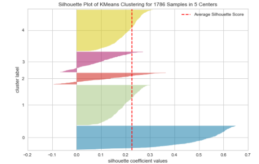

# Spotify_Artist_Recommender
--- 
#### Check out the application here: http://spotifyartistrecommender-v2.eba-mnhqin2v.us-east-2.elasticbeanstalk.com/
---
## Summary

In this project, I use the Spotipy API to collect songs and their features. I have gathered both my streaming history as well as 5000 songs from a large Spotify playlist (https://spotipy.readthedocs.io/en/2.16.0/)

I then take all of the artists (1700+) in these playlists and pulled their top 10 songs. I retrieve the features for all of these songs and then find the mean of features for each artists.

Each artists features are normalized with a MinMax scaler and stored in a csv. The scaler is also pickled and stored for use in the application.

You can then type in any Spotify artist, their features will be retrieved, aggregated and normalized. They will then be compared to every artist in the 1700 we have to find the most similar and recommend you a song!

The application is built on Flask and is hosted on AWS Elastic Beastalk.

-----------
## More

The scope and direction of this project changed a few times, so not all of the notebooks are directly related to the Song Recommender. If you want to see some visualization and exploratory analysis such as clustering, check out the Spotify Data Exploration File. The Spotify Song Collection file also has some good stuff on using the spotipy api that allows access to the spotify web API endpoints.

However, the most important files for the application are 

1) flask_app (where everything related to the application is coded and stored)

2) artist_feature_collection, where we create our artist feature dataset

## File 1: Spotify Song Collection

In this document, I outline how you can get access to your songs and song features with the Spotipy API. The data comes in a json file format with a couple issues that need to be worked around.

When you initially request your personal data from Spotify (via your online profile... NOT through the Spotipy Client), the features of the songs are not actually included. We need to use the API, as I have outlined here, to retrieve this information and put it into one dataframe.

Useful resources for using the API that I would have been lost without are linked directly in the notebook.

## File 2: Spotify Data Exploration

### Feature Selection and Engineering
Here I start to dig into the songs and their features. At the bottom of this readme, and at the start of this file you can find the provided features and their descriptions.

The first important step I take is to define what songs I actually 'like'. I needed a broad criteria that I could apply to all of my songs as I don't want to manually rate all of my songs.

All of the information I had for my streaming history was the length of time I played the song for each time that I played it. I then created my own features called "Skip", "Play", and "Like" so that I could better assess my sentiment towards a given song.

"Skip" was defined as playing the song for less than a minute, while "Play" was defined as letting play for more than a minute. I then defined a "Like" as any song that had a 75% play rate.

This feature engineering was a product of my first idea to create a recommender just for myself, which I later decided against.

### Clustering
The next step to take was to learn more about my data and song choice through clustering. (I have chosen KMeans to start, but it did not yield exceptional results in terms of the Elbow method or Silhouette score, so I will likely try another method soon).

The result was basically that only one of the clusters was significantly different than the others with a Silhouette score of 0.65, while the other clusters were scoring less than 0.3 for the most part.

The signficant cluster had high dancebility, high energy, and very low instrumentality. It also had a mean likes of 0.4 (not great). These songs are likely electronic dance music.

### Feature Descriptions:
acousticness — how acoustic

danceability — self-explanatory

energy — how 'fast, loud and noisy'

instrumentalness — the less vocals, the higher

liveness — whether there is audience in the recording

loudness — self-explanatory

speechiness — the more spoken words, the higher

valence — whether the track sounds happy or sad

tempo — the bpm
